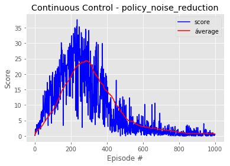
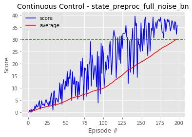
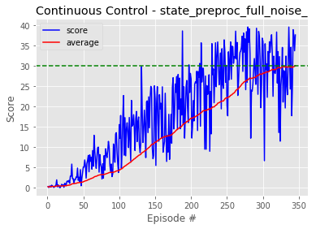
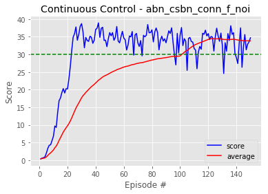

# Continuous Control Report

### Approach 

This project uses both the initial DDPG approach described in ["Continuous control with deep reinforcement learning"](https://arxiv.org/pdf/1509.02971.pdf)and also the TD3 enhancement from ["Addressing Function Approximation Error in Actor-Critic Methods](https://arxiv.org/pdf/1802.09477.pdf) with a few additional tricks and full grid search.
The `Actor` and `Critic` models are based configurable/parametrized implementation. This allows us to easily generate various grid-search patterns for the DAGs structure.

So for actor the class structure is:

```
class Actor(nn.Module):
    def __init__(self, input_size, output_size, layers=[256, 128], init_custom=True, use_bn=True):
        ...
         if use_bn:
            self.layers.append(nn.BatchNorm1d(pre_units))
        
        for i,L in enumerate(layers):
            if i == 0:
                use_bias = not use_bn
            else:
                use_bias = True
            self.layers.append(nn.Linear(pre_units, L, bias=use_bias))
            self.layers.append(nn.BatchNorm1d(L))
            self.layers.append(nn.ReLU())
            pre_units = L
        self.final_linear = nn.Linear(pre_units, output_size)
        self.final_activation = nn.Tanh()
        self.reset_parameters()
        return
           
        
    def forward(self, x):
        for layer in self.layers:
            x = layer(x)
        x = self.final_linear(x)
        x = self.final_activation(x)
        return x

```

And for the critic is slightly more complicated to accomodate the non-sequential graph pattern that would enable us to construct learned features for both the input state and the input action and then combine them together:

```
class Critic(nn.Module):
    def __init__(self, state_size, act_size, output_size=1, leaky=False, init_custom=True,
                 act_layers=[], 
                 state_layers=[256], 
                 final_layers=[256, 128],
                 state_bn=True,
                 other_bn=True,
                 ):
                 
        ... 
        
        pre_units = state_size
        if len(state_layers) > 0:
            self.state_layers = nn.ModuleList()
            for L in state_layers:
                self.state_layers.append(nn.Linear(pre_units, L))
                if state_bn:
                    self.state_layers.append(nn.BatchNorm1d(L))
                if leaky:
                    self.state_layers.append(nn.LeakyReLU())
                else:
                    self.state_layers.append(nn.ReLU())
                pre_units = L
        final_state_column_size = pre_units

        pre_units = act_size
        if len(act_layers) > 0:
            self.act_layers = nn.ModuleList()
            for L in act_layers:
                self.act_layers.append(nn.Linear(pre_units, L))
                if other_bn:
                    self.act_layers.append(nn.BatchNorm1d(L))                    
                if leaky:
                    self.act_layers.append(nn.LeakyReLU())
                else:
                    self.act_layers.append(nn.ReLU())
                pre_units = L
        final_action_column_size = pre_units
            
        pre_units = final_state_column_size + final_action_column_size
        for L in final_layers:
            self.final_layers.append(nn.Linear(pre_units, L))
            if other_bn:
                self.final_layers.append(nn.BatchNorm1d(L))                    
            if leaky:
                self.final_layers.append(nn.LeakyReLU())
            else:
                self.final_layers.append(nn.ReLU())
            pre_units = L        
            
        self.final_linear = nn.Linear(pre_units, output_size)
    
               
        ... 
        
        
    def forward(self, state, action):
        x_state = state
        if hasattr(self, "state_layers"):
            for layer in self.state_layers:
                x_state = layer(x_state)
            
        x_act = action
        if hasattr(self, "act_layers"):
            for layer in self.act_layers:
                x_act = layer(x_act)
        
        x = torch.cat((x_state, x_act), dim=1)
        
        for layer in self.final_layers:
            x = layer(x)    
        
        x = self.final_linear(x)
        return x
```

The initialization of the weights is also parametrized in order to allow both DDPG-style initialization `w=uniform(-1/sqrt(fan_in), 1/sqrt(fan_in))` or Glorot-uniform where the +/- limit is `sqrt(6/(fan_in+fan_out))`. 

```
def init_layers(layers, init_custom):
    for layer in layers:
        if hasattr(layer,"weight"):
            if init_custom:
                layer.weight.data.uniform_(*hidden_init(layer))
            else:
                nn.init.xavier_uniform_(layer.weight)

        if hasattr(layer,"bias"):
            if layer.bias is not None:
                if init_custom:
                    layer.bias.data.uniform_(*hidden_init(layer))
                else:
                    nn.init.xavier_uniform_(layer.bias)
```
The initial iteration have been designed only for exploration purposes and the later (final) ones contain the actual grid-search and solutions.

### Iteration #1
First iteration with no noise reduction reched a 24.5 average at episode 250 then plateaued at 22-23.
```
First training iter at step 1010
Episode   50  Score/Max/Avg:  5.3/ 7.8/ 2.8  AvStp: 1000  [μcL1/μcL2:  7.4e-04/ 6.9e-04 μaL:  2.7e-01]  
  Loaded steps:      50050
  Train iters:       24521
  Actor update:      12260
Episode  100  Score/Max/Avg: 16.5/16.5/ 5.9  AvStp: 1000  [μcL1/μcL2:  1.5e-03/ 1.5e-03 μaL:  3.6e-01]  
  Loaded steps:     100100
  Train iters:       49550
  Actor update:      24775
Episode  150  Score/Max/Avg: 13.2/36.7/13.0  AvStp: 1000  [μcL1/μcL2:  5.7e-03/ 5.8e-03 μaL:  1.6e-01] 
  Loaded steps:     150150
  Train iters:       74571
  Actor update:      37285
Episode  200  Score/Max/Avg: 22.8/39.3/20.5  AvStp: 1000  [μcL1/μcL2:  1.1e-02/ 1.1e-02 μaL: -9.6e-01]  
  Loaded steps:     200200
  Train iters:       99600
  Actor update:      49800
Episode  250  Score/Max/Avg: 24.1/39.3/24.5  AvStp: 1000  [μcL1/μcL2:  1.8e-02/ 1.6e-02 μaL: -5.2e-01]  
  Loaded steps:     250250
  Train iters:      124621
  Actor update:      62310
Episode  300  Score/Max/Avg: 29.4/39.3/22.9  AvStp: 1000  [μcL1/μcL2:  6.7e-02/ 7.0e-02 μaL:  9.3e-01]  
  Loaded steps:     300300
  Train iters:      149650
  Actor update:      74825
Episode  350  Score/Max/Avg: 21.5/39.5/21.5  AvStp: 1000  [μcL1/μcL2:  3.9e-01/ 3.6e-01 μaL:  2.0e+00]  
  Loaded steps:     350350
  Train iters:      174671
  Actor update:      87335
```

### Iteration #2
with exploration noise reduction we get similar results:

``` 
First training iter at step 1010
Episode   50  Score/Max/Avg:  6.9/ 6.9/ 2.7  AvStp: 1000  [μcL1/μcL2:  4.4e-04/ 4.4e-04 μaL:  2.6e-01]  
  Loaded steps:      50050
  Train iters:       24521
  Actor update:      12260

New explor noise: 0.0750
Episode  100  Score/Max/Avg: 13.6/19.3/ 5.8  AvStp: 1000  [μcL1/μcL2:  1.5e-03/ 1.4e-03 μaL:  2.8e-01] 
  Loaded steps:     100100
  Train iters:       49550
  Actor update:      24775

New explor noise: 0.0563
Episode  150  Score/Max/Avg: 30.4/34.6/13.1  AvStp: 1000  [μcL1/μcL2:  9.8e-03/ 1.3e-02 μaL:  2.0e-01] 
  Loaded steps:     150150
  Train iters:       74571
  Actor update:      37285

New explor noise: 0.0422
Episode  200  Score/Max/Avg: 25.9/34.8/19.3  AvStp: 1000  [μcL1/μcL2:  9.1e-03/ 8.6e-03 μaL: -6.5e-01] 
  Loaded steps:     200200
  Train iters:       99600
  Actor update:      49800

New explor noise: 0.0316
Episode  250  Score/Max/Avg: 24.5/36.9/25.0  AvStp: 1000  [μcL1/μcL2:  1.7e-02/ 1.5e-02 μaL: -1.3e+00] 
  Loaded steps:     250250
  Train iters:      124621
  Actor update:      62310

New explor noise: 0.0237
Episode  300  Score/Max/Avg: 22.9/36.9/27.0  AvStp: 1000  [μcL1/μcL2:  3.0e-02/ 2.7e-02 μaL: -6.2e-01] 
  Loaded steps:     300300
  Train iters:      149650
  Actor update:      74825

New explor noise: 0.0178
Episode  350  Score/Max/Avg: 20.6/36.9/19.4  AvStp: 1000  [μcL1/μcL2:  1.5e+00/ 1.4e+00 μaL:  1.6e+01] 
  Loaded steps:     350350
  Train iters:      174671
  Actor update:      87335

New explor noise: 0.0133
Episode  400  Score/Max/Avg:  3.5/36.9/11.3  AvStp: 1000  [μcL1/μcL2:  5.8e+00/ 6.1e+00 μaL:  5.0e+01] 
  Loaded steps:     400400
  Train iters:      199700
  Actor update:      99850

```

### Iteration #3

3rd iteration tests the policy noise reduction (this time we also introduce a weight debug monitoring procedure).
First, here is the training history:



And the actual log for some important milestones:

```
First training iter at step 1010
Episode   50  Score/Max/Avg:  6.4/13.1/ 4.1  AvStp: 1000  [μcL1/μcL2:  7.4e-04/ 6.9e-04 μaL:  2.0e-01]  
  Loaded steps:      50050
  Train iters:       24521
  Actor update:      12260
Model Actor min/max/mean/median:
  layers.0.weight:           -1.9e+00 /  2.3e+00 /  1.9e-02 /  1.6e-02
  layers.0.bias:             -4.8e-01 /  2.3e-01 / -1.4e-01 / -1.4e-01
  layers.2.weight:           -9.7e-01 /  6.6e-01 / -3.5e-02 / -2.7e-02
  layers.2.bias:             -2.8e-01 /  1.7e-01 / -4.0e-02 / -3.0e-02
  final_linear.weight:       -6.4e-01 /  6.0e-01 /  1.1e-02 /  6.4e-03
  final_linear.bias:         -3.9e-02 /  1.1e-01 /  4.7e-02 /  5.9e-02
Model Critic min/max/mean/median:
  final_layers.0.weight:     -1.1e+00 /  6.3e-01 / -4.6e-02 / -3.4e-02
  final_layers.0.bias:       -1.7e-01 /  2.3e-01 /  1.1e-02 /  3.7e-03
  state_layers.0.weight:     -2.0e+00 /  2.6e+00 /  1.3e-02 /  1.1e-02
  state_layers.0.bias:       -4.9e-01 /  1.5e-01 / -1.7e-01 / -1.8e-01
  final_linear.weight:       -7.0e-02 /  1.6e-01 / -1.1e-02 / -2.1e-02
  final_linear.bias:          4.1e-02 /  4.1e-02 /  4.1e-02 /  4.1e-02

New policy noise: 0.1600
Episode  100  Score/Max/Avg: 13.1/20.6/ 8.1  AvStp: 1000  [μcL1/μcL2:  2.9e-03/ 2.6e-03 μaL:  9.1e-02] 

New policy noise: 0.1280
Episode  150  Score/Max/Avg: 17.6/30.2/14.6  AvStp: 1000  [μcL1/μcL2:  4.2e-03/ 4.1e-03 μaL: -4.3e-01] 

New policy noise: 0.1024
Episode  200  Score/Max/Avg: 28.7/30.2/19.1  AvStp: 1000  [μcL1/μcL2:  9.6e-03/ 9.5e-03 μaL: -4.0e-01] 

New policy noise: 0.0819
Episode  250  Score/Max/Avg: 27.3/37.6/23.4  AvStp: 1000  [μcL1/μcL2:  1.6e-02/ 1.6e-02 μaL: -8.7e-01] 


New policy noise: 0.0655
Episode  300  Score/Max/Avg: 34.2/37.6/24.0  AvStp: 1000  [μcL1/μcL2:  3.9e-02/ 3.6e-02 μaL: -2.3e-01] 
  Loaded steps:     300300
  Train iters:      149650
  Actor update:      74825
Model Actor min/max/mean/median:
  layers.0.weight:           -3.6e+00 /  3.7e+00 /  6.6e-03 /  1.0e-02
  layers.0.bias:             -7.0e-01 /  3.4e-01 / -3.0e-01 / -3.1e-01
  layers.2.weight:           -2.0e+00 /  1.3e+00 / -5.6e-02 / -3.8e-02
  layers.2.bias:             -6.6e-01 /  3.6e-01 / -1.6e-01 / -1.4e-01
  final_linear.weight:       -7.2e-01 /  8.3e-01 /  1.1e-02 /  1.3e-02
  final_linear.bias:         -1.3e-01 /  3.1e-01 /  1.3e-01 /  1.8e-01
Model Critic min/max/mean/median:
  final_layers.0.weight:     -4.3e+00 /  1.9e+00 / -1.1e-01 / -6.3e-02
  final_layers.0.bias:       -7.8e-01 /  9.2e-01 / -1.2e-02 / -5.3e-02
  state_layers.0.weight:     -5.7e+00 /  7.5e+00 /  9.9e-03 /  1.1e-02
  state_layers.0.bias:       -1.1e+00 /  3.6e-01 / -3.8e-01 / -3.7e-01
  final_linear.weight:       -3.7e-01 /  3.1e-01 / -7.2e-02 / -7.6e-02
  final_linear.bias:          1.6e+00 /  1.6e+00 /  1.6e+00 /  1.6e+00

New policy noise: 0.0524
Episode  350  Score/Max/Avg: 25.3/37.6/18.8  AvStp: 1000  [μcL1/μcL2:  1.9e-01/ 1.9e-01 μaL:  4.6e+00] 


New policy noise: 0.0500
Episode  400  Score/Max/Avg: 11.5/37.6/14.4  AvStp: 1000  [μcL1/μcL2:  1.2e-01/ 1.2e-01 μaL:  3.8e+00] 
  Loaded steps:     400400
  Train iters:      199700
  Actor update:      99850
Model Actor min/max/mean/median:
  layers.0.weight:           -4.4e+00 /  4.4e+00 /  3.4e-03 /  8.4e-03
  layers.0.bias:             -7.7e-01 /  3.1e-01 / -3.6e-01 / -3.8e-01
  layers.2.weight:           -2.2e+00 /  1.5e+00 / -6.0e-02 / -4.2e-02
  layers.2.bias:             -8.1e-01 /  5.4e-01 / -2.0e-01 / -1.8e-01
  final_linear.weight:       -9.4e-01 /  9.5e-01 /  5.9e-03 /  1.8e-03
  final_linear.bias:         -1.8e-01 /  2.8e-01 /  2.4e-02 / -1.7e-03
Model Critic min/max/mean/median:
  final_layers.0.weight:     -5.1e+00 /  3.3e+00 / -1.2e-01 / -6.7e-02
  final_layers.0.bias:       -9.0e-01 /  1.2e+00 /  1.2e-02 / -3.5e-02
  state_layers.0.weight:     -6.8e+00 /  8.9e+00 /  9.7e-04 /  8.6e-03
  state_layers.0.bias:       -1.2e+00 /  6.3e-01 / -4.4e-01 / -4.7e-01
  final_linear.weight:       -5.8e-01 /  3.5e-01 / -8.9e-02 / -7.7e-02
  final_linear.bias:          9.5e-01 /  9.5e-01 /  9.5e-01 /  9.5e-01
  
```

At this point one particular important observation is the dependency of the convergence to the actual size of the replay memory.
To be more specific the difference between memory size of `1e5` and `1e6` is between *initial convergence* and *non-convergence*

### The Grid Search

From this initial exploration phase we continue with agregating multiple architectural options and we construct a grid-search procedure. Most notably, the _batch normalization_ has been included to the architectural grid-search based on [https://arxiv.org/pdf/1509.02971.pdf].

To summarize, the grid has the following architectural options:

| Parameter | Values |
|----|:------:|
|Batch Norm on critic state features| yes/no |
|Batch Norm on actor| yes/no|
|Batch Norm on critic final layers| yes/no|
|State feats| yes/no |
|explore noise| non-stop / stop after 300 ep|
|policy noise| non-stop / stop after 300 ep|


### The first grid-search results

After a few iterations we run the below architecture using the following exploration-training approach:
1. We load `RANDOM_WARM_UP` (default 1024) randomly sampled steps (not using the policy DAG as described by the papers)
2. We use the noisy exploratory policy to generate `train_every_steps` steps (default 10)
3. For another `train_every_steps` steps we both generate actions with the noisy policy and run the TD3 training procedure
4. Repeat from step 2

```
Actor DAG:
Actor(
  (layers): ModuleList(
    (0): BatchNorm1d(33, eps=1e-05, momentum=0.1, affine=True, track_running_stats=True)
    (1): Linear(in_features=33, out_features=256, bias=False)
    (2): BatchNorm1d(256, eps=1e-05, momentum=0.1, affine=True, track_running_stats=True)
    (3): ReLU()
    (4): Linear(in_features=256, out_features=128, bias=True)
    (5): BatchNorm1d(128, eps=1e-05, momentum=0.1, affine=True, track_running_stats=True)
    (6): ReLU()
  )
  (final_linear): Linear(in_features=128, out_features=4, bias=True)
  (final_activation): Tanh()
)
Critic DAG:
Critic(
  (final_layers): ModuleList(
    (0): Linear(in_features=260, out_features=256, bias=True)
    (1): ReLU()
    (2): Linear(in_features=256, out_features=128, bias=True)
    (3): ReLU()
  )
  (state_layers): ModuleList(
    (0): Linear(in_features=33, out_features=256, bias=True)
    (1): BatchNorm1d(256, eps=1e-05, momentum=0.1, affine=True, track_running_stats=True)
    (2): ReLU()
  )
  (final_linear): Linear(in_features=128, out_features=1, bias=True)
)
```
_Observation: in the above Critic DAG description there is a small display error as `final_layers` should appear after `state_layers` and not before._

#### A solution is reached

After 198 episodes the environment is solved with the above architecture showing that the optimal approach for the proposed TD3 procedure is to _featurize_ the state input before concatenating to the action input in the critic DAG.



```
Starting training for 351 episodes...
  explor_noise_reduction=False
  policy_noise_reduction=False
  stop_policy_noise=0
  stop_explor_noise=0

First training iter at step 522
Episode   50  Score/M100/Avg: 12.9/13.5/ 4.6  AvStp: 1000  [μcL1/μcL2:  8.3e-04/ 7.6e-04 μaL: -1.5e-01] 
Episode  100  Score/M100/Avg: 24.1/29.1/10.0  AvStp: 1000  [μcL1/μcL2:  2.7e-03/ 2.5e-03 μaL: -5.2e-01]  
Episode  150  Score/M100/Avg: 36.8/39.5/20.7  AvStp: 1000  [μcL1/μcL2:  4.7e-03/ 4.4e-03 μaL: -1.5e+00]  
Episode  198  Score/M100/Avg: 35.6/39.5/30.1  Steps: 1000  [μcL1/μcL2:  8.3e-03/ 8.0e-03 μaL: -2.4e+00] 
Environment solved at episode 198!

```
The saved actor model can be found [here](models/single_state_preproc_full_noise_bn_actor_it_0000098840_ep_198_solved.policy)

#### The runner-up

Notably is that the above architecture - with the only modification of dropping the batch normalization - reaches a solution with the TD3 algorithm much later, as shown in below image. The policy model can be found in [here](models/single_state_preproc_full_noise__actor_it_0000172414_ep_345_solved.policy)




## Second stage: multi worker environment

Now we re-run the whole part of the grid-search experiment in the multi-worker setting of the _Unity Reacher_ environment. 
Using the identical architecture from the previous single-worker experiment we obtain a solution much faster (102 episodes) and more stable. This is largely due to the reduced variance caused by the collection of observations from the un-correlated multiple parallel workers.



The multi-worker trained policy can be found in models subfolder [here](models/multi_abn_csbn_conn_f_noi_actor_it_0000051021_ep_102_solved.policy)